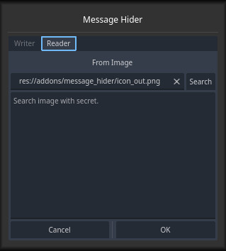

# Message Hider
Addon for Godot 4, this addon allow hide a text message in a Image.

[](https://godotengine.org/)  

# Features
* Write a text message to the image.
* Read a text message from the image.

# How Work

* You can use the GUI in: **Project > Tools > Message Hider**
* You can direct call by script.
>[!TIP]
>Use a image (Recommended PNG Format) to write a message in and then you can read that created message.
>
>The images created are in PNG format.

### Direct call
```python
## For set Text to Image:
MessageHider.text_to_image(input_image_path, secret_text_message, out_file_image_as_png_path)

## For get text from image:
MessageHider.text_from_image(input_image_with_secret_path)
```


### Writer Preview


### Reader Preview


#
Copyrights (c) CodeNameTwister. See [LICENSE](LICENSE) for details.

[godot engine]: https://godotengine.org/
